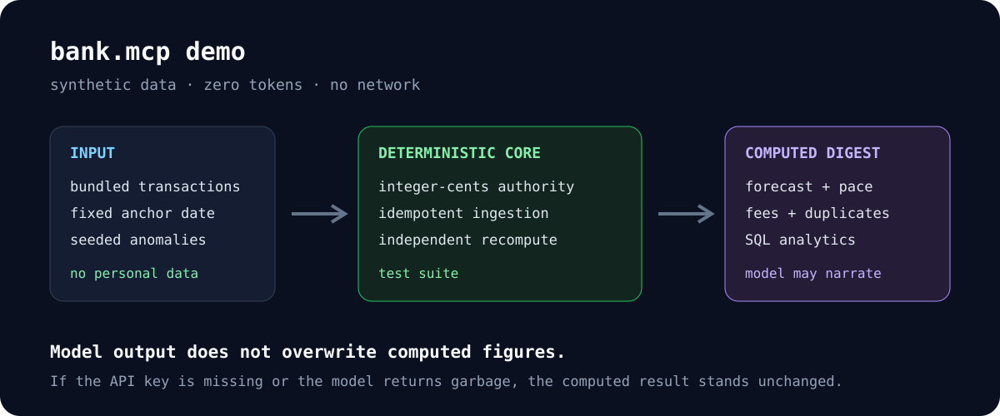

# bank.mcp

bank.mcp is a local personal-finance analysis suite built around a SQLite store and seven
deterministic engines. It forecasts cash flow, measures savings pace, reports spending, detects
fee and duplicate-charge candidates, finds recurring streams, and reconciles receipts. Monetary
storage and aggregation use integer cents; model output cannot overwrite stored values or computed
figures.

A fluent forecast can still cost money when it is wrong. bank.mcp keeps stored transactions,
aggregation, forecasts, and anomaly classifications under deterministic code. Optional model paths
may add prose or propose bounded inputs, but those outputs do not become computed truth merely
because they sound plausible.

The declared model-input inventory is: a compact computed summary for narration; merchant-name
lists for matching; receipt email text for candidate field extraction; one merchant name for a
best-guess contact address; and typed merchant, amount, date, expected amount, and reason fields for a
refund draft. Extracted receipt fields and generated addresses or prose are untrusted inputs.
The current call sites pass no raw bank rows or dedicated account-number or transaction-ID fields.
Free-form refund evidence remains in the local dispute ledger and never enters the model prompt. The
synthetic demo and public MCP tools run with no API key, model call, or network access.

The runtime uses only the Python standard library (`dependencies = []`). It has no ORM, application framework, or MCP SDK.



## What it does

Turns a SQLite store of bank transactions into **one digest**: a cash-flow / overdraft forecast, savings-goal pace against a target date, a spending breakdown, a fee + duplicate-charge scan, recurring-stream detection, and receipt reconciliation. One orchestrator (`finance_agent.build_digest`) reconciles receipts first, runs each engine, and collates a single ~1K-token summary — which is the *only* thing narration ever sees.

```bash
bank-mcp demo        # builds + prints the digest from bundled synthetic data — no bank, no key, no network
```

The command prints a deterministic digest like this:

```text
# bank.mcp — UNIFIED MONTHLY DIGEST
## What matters
- Clear: balance stays at or above the $100.00 buffer for the full 35-day horizon (min $1,087.44 on May 6, 2026).
- Fee/fraud: $49.99 recoverable this 30d.
## savings pace
- Pace $2,966.67/mo vs $1,257.14/mo needed → projected $21,966.69 by Dec 1, 2026 → AHEAD (12.0% to $10,000.00)
## Fee + fraud scan (30d)
- duplicates $49.99 recoverable (1)  · dup: Online Store $49.99 2026-04-24 & 2026-04-24
```

The demo data is deterministic (fixed anchor date, seeded RNG) and doubles as the committed test fixture — it plants a duplicate charge, two bank fees, a recurring drift, and a self-transfer so each detector has something real to catch.

## What enforces the boundary

- **`money.py` is the single integer-cents authority.** `store/db.py` writes `amount` as integer cents, so the SQL read-models sum exact integers and aggregation never drifts. Rounding is half-up in one place.
- **The math is checked twice.** The SQL reporting rollups in `store/queries.sql` (monthly cash flow with a running total + month-over-month delta, category share-of-spend, ranked top merchants — CTEs and `SUM() OVER` / `LAG()` / `RANK()`) are cross-checked against an independent Python recompute in `tests/test_analytics.py`. Two paths to the same number.
- **The model boundary is an executable architecture rule, not a comment.** `tests/test_finance_agent.py::TestNoRawRows` fails if a raw-transaction shape reaches narration. `tests/test_model_boundary_docs.py` pins calls to the two declared model transports, rejects recognized model clients or endpoint ownership elsewhere, and requires every declared caller to match the public inventory. The static guard does not claim to infer an intentionally disguised network transport from arbitrary Python. Missing keys and malformed responses fall back to deterministic results or templates.
- **Ingestion is idempotent.** `store/db.py`'s upsert is keyed on transaction id, and a posted charge supersedes its stale `pending` row — re-ingesting a batch never double-counts. `owner` and `currency` are columns, so a second account holder or currency requires more rows, not a migration.

## Run it

```bash
python -m venv .venv && source .venv/bin/activate
pip install -e ".[dev]"        # dev tools only; the package itself needs nothing

bank-mcp demo                  # full digest from synthetic data
bank-mcp analytics             # the SQL reporting rollups
pytest -q                      # test suite
```

CI runs the suite across Python 3.10–3.13, enforces at least 70% coverage on the testable core, and checks `ruff` and `mypy`. `bank-mcp-server` exposes the synthetic demo to MCP clients through a JSON-RPC 2.0 stdio server with four tools: `build_digest`, `monthly_cashflow`, `category_breakdown`, and `top_merchants`. The server implements its bounded MCP surface directly so the runtime stays dependency-free.

**Everything in the repository is synthetic.** The demo generator produces fake merchants, amounts, and dates; no real financial data is committed. For local runs with external services, secrets resolve from environment variables and then macOS Keychain, never from tracked files.

## Limits

- The public MCP server exposes synthetic data only. Real account ingestion is a separate, local
  operator path.
- This is a single-user reporting tool, not a ledger, payment system, fraud decision engine, or
  financial adviser.
- Fee, duplicate-charge, and receipt results are review candidates. They do not authorize a charge,
  refund, dispute, or message.
- Model-proposed receipt fields, merchant contacts, and draft text require review. A generated
  address is not evidence that the address is current or owned by the merchant.
- `safehttp` constrains declared outbound requests but is not a complete network sandbox or a full
  DNS-rebinding defense.
- Integer cents protect storage and aggregation. Some bounded reporting calculations use floats
  rounded at display boundaries, as documented in [`docs/DECISIONS.md`](docs/DECISIONS.md).

## Where to look first

- [`docs/ARCHITECTURE.md`](docs/ARCHITECTURE.md) — the layered pipeline, the SQLite schema, and the LLM boundary, with file references.
- `src/bank_mcp/money.py` — the integer-cents rounding authority.
- `src/bank_mcp/store/queries.sql` — the SQL reporting read-models, written to read top to bottom.
- `src/bank_mcp/engines/` — the seven deterministic cores (forecast, budget, fee/fraud, recurring, receipt reconciliation, dispute, categorizer); `llm_matcher.py` contains matching and extraction calls, while `dispute_agent.py` contains contact and draft calls.
- [`docs/DECISIONS.md`](docs/DECISIONS.md) — why SQLite over Postgres, and the set-based-reporting-in-SQL / algorithmic-forecasting-in-Python split.

Apache-2.0 — see [LICENSE](LICENSE).
