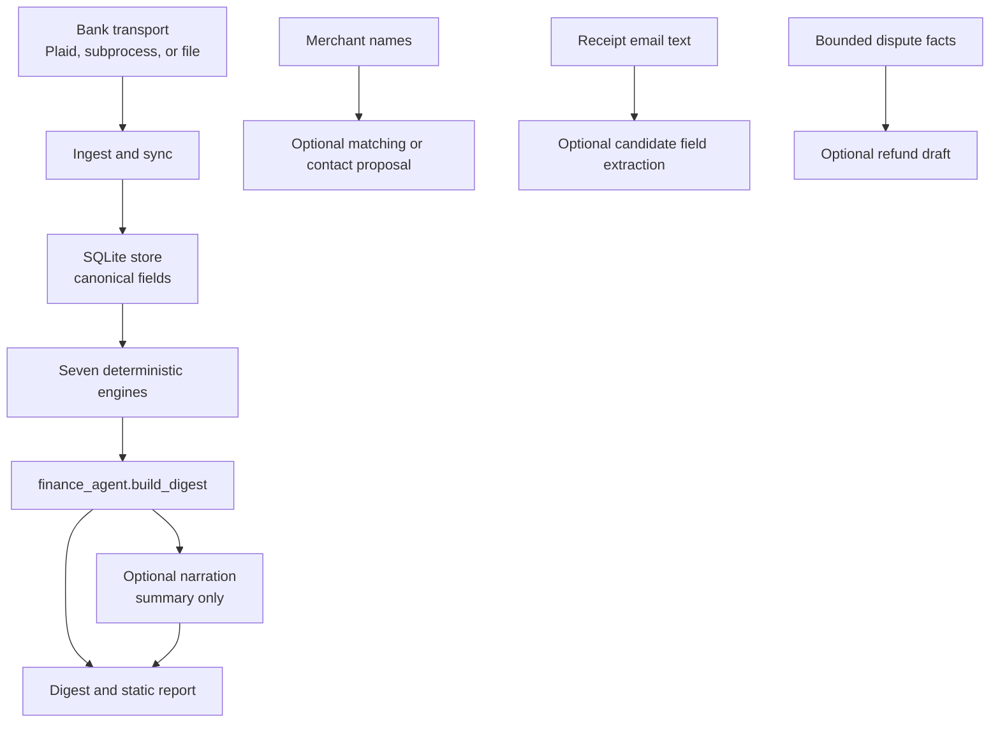

# Architecture

A layered pipeline with one canonical accessor at the base and one orchestrator on
top. Data flows in one direction; the dependency graph is acyclic.

Diagram: A bank transport feeds the idempotent ingest path and SQLite store. Seven deterministic
engines produce summaries for `finance_agent.build_digest`, which writes the report directly and
may ask a model to narrate the computed summary. Separate optional paths use merchant names for
matching or contact proposals, receipt email text for candidate field extraction, and bounded
dispute facts for draft prose. None receives raw bank transaction rows or overwrites stored values
or computed figures.

## Layers
**`ingest/` — getting data in.**
`safehttp.fetch()` is the single outbound-HTTP chokepoint (enforces HTTPS, bounds a
timeout, blocks non-HTTPS redirects). `plaid_bridge` is the bank transport (a
bank-mcp subprocess fork, direct Plaid, or a file snapshot, tried in order, with a
`BankMCPError` boundary). `plaid_link` mints access tokens. `sync` orchestrates a
pull → DB upsert → analysis run and persists cursor/sync state.

**`store/` — the source of record + the canonical field layer.**
`db.py` is a single-file SQLite store. The write path is an **idempotent upsert keyed
on transaction id**, where a posted charge supersedes its stale `pending` row, so
re-ingesting a batch never duplicates. The read adapter reconstructs the exact
engine-shaped dict from a lossless `raw` JSON column.
`subscription_creep.py` is the **canonical field accessor** — every engine reads
amounts, signs, dates, merchant identity, and cadence through it (`is_outflow`,
`amount_magnitude`, `parse_date`, `merchant_key`, `classify_cadence`, …) rather than
re-deriving them. `obligation_registry` models forward commitments; `merchant_categorizer`
maps transactions to human categories.
`queries.sql` + `analytics.py` are the **SQL reporting read-models** — monthly cash
flow (running total + month-over-month delta), category breakdown (share of spend),
and top merchants — computed as CTE/window-function queries over the typed columns,
because set-based reporting is what SQL is for (the algorithmic forecasting stays in
Python). `tests/test_analytics.py` cross-checks each query against a Python recompute.

**`engines/` — the deterministic cores.**
`cashflow_forecaster` (projection / overdraft), `budget_scorer` (savings-goal pace),
`fee_fraud_scan` (fees + duplicate charges), `recurring` (recurring streams),
`receipt_scanner` (reconciliation), `dispute_agent` (dispute tracking),
`merchant_categorizer`. Each returns a compact summary dict (~1K tokens), never raw
rows. `llm_matcher` calls the model for merchant matching and receipt extraction;
`dispute_agent` calls it for merchant-contact proposals and refund-draft prose.

**`report/` — rendering and serving.**
`delivery` holds the delivery primitives (`money()` / `fmt_date()` / `send_email()` /
`call_haiku()` / `narrate()`). `digest_templates` assembles the report page from
`_report_sections` (per-section builders) using `_report_styles` (CSS/SVG) and
`_report_format` (date/money helpers); `email_html` renders the email HTML. `build_site` assembles a
self-contained static `./site` (landing page + report + assets) for an auth-gated
Vercel deploy.

**`finance_agent.py` — the orchestrator.**
`build_digest()` runs reconciliation first, then each engine core (imported, never
reimplemented), collates one combined digest, and runs at most one LLM "narrate"
pass over the compact summary.

## The SQLite schema (shape)

`transactions` carries **typed columns for querying** — `id` (PK), `account_id`,
`owner`, `date`, `amount` (integer cents), `direction`, `currency`, `merchant_name`,
`category_raw`, `pending` — plus a **`raw` TEXT column holding the original
transaction dict verbatim**. Indexed on `(owner, date)`.

The typed columns are a query/filter index; the engines' actual data source is the
`raw` blob, reconstructed losslessly by `load_transactions_from_db()`. That keeps the
engine output byte-identical whether it reads from JSON or the DB. `owner` /
`currency` are columns, so a second account holder or a second currency is just
more rows — no schema migration.

## The LLM boundary

Five bounded inputs can reach a prompt:

1. A compact computed summary for narration.
2. Merchant-name lists for matching.
3. Receipt email text for candidate amount, merchant, and date extraction.
4. One merchant name for a best-guess support address.
5. Typed merchant, amount, date, expected amount, and reason fields for refund-draft prose.

The current call sites pass no raw bank rows or dedicated account-number or transaction-ID fields.
Free-form refund evidence stays in the local dispute ledger and never enters the model prompt.
Receipt extraction can propose an amount, and draft generation receives an already computed
amount, so neither output is described as computed truth. The deterministic report remains usable
without a model; `--no-voice` disables narration, while draft and extraction paths have their own
explicit triggers and fallbacks. `tests/test_finance_agent.py::TestNoRawRows` checks the narration
payload. `tests/test_model_boundary_docs.py` pins callers of the two declared model transports,
rejects recognized model clients or endpoint ownership outside those modules, and fails when the
declared callers diverge from this documented inventory. That static architecture guard does not
claim to detect an intentionally disguised network transport from arbitrary Python.

See [DECISIONS.md](DECISIONS.md) for why the storage/analysis split is shaped this way.
